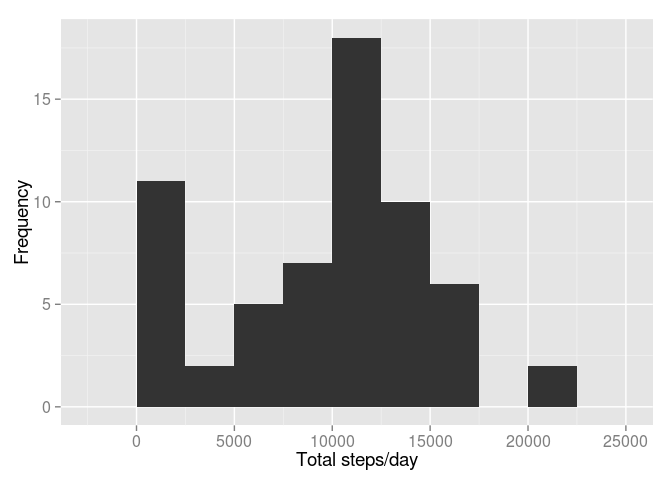
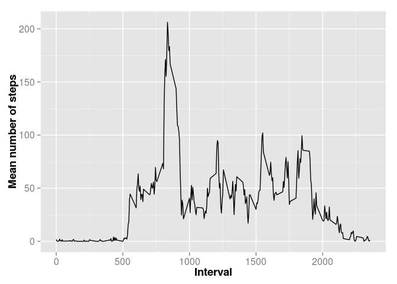
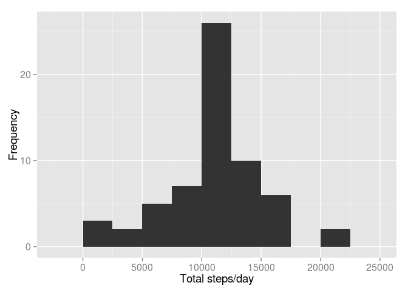
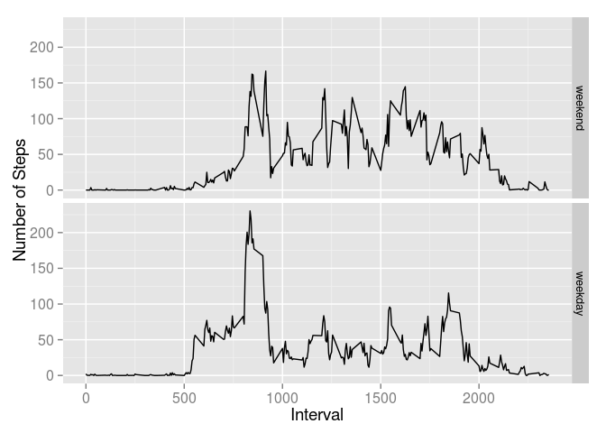

# Reproducible Research: Peer Assessment 1


## Loading and preprocessing the data

Load the data:
First, we read the date coercing the date column to character rather than factor


```r
activityData <- read.csv ("activity.csv", header = T, sep = ",", stringsAsFactors = F)
```
Now we convert the date column to the appropriate format:
  

```r
activityData$date <- as.Date(activityData$date, "%Y-%m-%d")
str(activityData)
```

```
## 'data.frame':	17568 obs. of  3 variables:
##  $ steps   : int  NA NA NA NA NA NA NA NA NA NA ...
##  $ date    : Date, format: "2012-10-01" "2012-10-01" ...
##  $ interval: int  0 5 10 15 20 25 30 35 40 45 ...
```

# Analysis

## 1. What is the mean total number of steps taken per day?

We can use dplyr to group and summarize the data and store it in the variable AvgDay, the following lines calculate the total number of steps per day and the mean number of daily steps:


```r
library (dplyr)
```

```
## 
## Attaching package: 'dplyr'
## 
## The following objects are masked from 'package:stats':
## 
##     filter, lag
## 
## The following objects are masked from 'package:base':
## 
##     intersect, setdiff, setequal, union
```

```r
AvgDay <- activityData %>% group_by(date) %>%
          summarize(total.steps = sum(steps, na.rm = T), 
                  mean.steps = mean(steps, na.rm = T))
```
Once the summaries are calculated, we can construct the histogram of the total steps:


```r
library(ggplot2)
g <- ggplot(AvgDay, aes(x=total.steps))
g + geom_histogram(binwidth = 2500) + theme(axis.text = element_text(size = 12),  
      axis.title = element_text(size = 14)) + labs(y = "Frequency") + labs(x = "Total steps/day")
```

 

Let's get a summary of the data, which will include the mean and the median


```r
summary(AvgDay$total.steps)
```

```
##    Min. 1st Qu.  Median    Mean 3rd Qu.    Max. 
##       0    6778   10400    9354   12810   21190
```
## 2. What is the daily activity pattern?

In this section we will average the number of steps across each 5 min interval, this will give us an idea of the periods where the person might be the most and the least active (aka, a screen shot of a “typical/average” day).

We group the data by interval this time and then calculate the mean of each interval goup:


```r
AvgInterval <- activityData %>% group_by(interval) %>%
      summarize(mean.steps = mean(steps, na.rm = T))
g <- ggplot(AvgInterval, aes(x = interval, y = mean.steps))
g + geom_line() + theme(axis.text = element_text(size = 12), 
      axis.title = element_text(size = 14, face = "bold")) + 
      labs(y = "Mean number of steps") + labs(x = "Interval")
```

 


We can observe the largest amount of steps occurs between time intervals 500 and 1000. The maximum average number of steps is: 206 and occurs in time interval #835

## 3. Imputing missing values

the number of rows that contain an NA.


```r
sum(is.na(activityData$steps))
```

```
## [1] 2304
```

Using the average steps per interval. We will use this metric to fill in the NAs.

Next we create a duplicate of the original data named newData and we will draw the appropriate values AvgInterval:


```r
newData <- activityData
```

In order to fill in missing values we check at each row if the column interval is NA, when the condition is true we look for the corresponding interval (index), we search for this particular interval in the AvgInterval data and extract it to a temporary variable values. Last we choose only the column of interest from values, which is the mean.steps and assign this number to the corresponding position in the newData set. We use a for loop to run through all the rows.


```r
for (i in 1:nrow(newData)) {
      if (is.na(newData$steps[i])) {
            index <- newData$interval[i]
            value <- subset(AvgInterval, interval==index)
            newData$steps[i] <- value$mean.steps
      }
}
```

We use a similar method as before to group the data by date and calculate daily totals:


```r
newAvg <- newData %>% group_by(date) %>%
      summarize(total.steps = sum(steps, na.rm = T))
```

And we can construct the histogram:


```r
g <- ggplot(newAvg, aes(x=total.steps))
g + geom_histogram(binwidth = 2500) + theme(axis.text = element_text(size = 12),
      axis.title = element_text(size = 14)) + labs(y = "Frequency") + labs(x = "Total steps/day")
```

 

This figure shows, similarly to the first histogram, symmetrically distributed data around the maximum without the column in the extreme left (which contained the days with missing data). One must notice that filling values with the interval means increases the frequencies in the 10000-12500 class, which contains the median.
For a more quantitative comparison lets review the 5 number summaries and standard deviations of the original data AvgDay vs the data with the imputed values newData


```r
summary (AvgDay$total.steps)
```

```
##    Min. 1st Qu.  Median    Mean 3rd Qu.    Max. 
##       0    6778   10400    9354   12810   21190
```


```r
sd(AvgDay$total.steps, na.rm=T)
```

```
## [1] 5405.895
```


```r
summary (newAvg$total.steps)
```

```
##    Min. 1st Qu.  Median    Mean 3rd Qu.    Max. 
##      41    9819   10770   10770   12810   21190
```


```r
sd(newAvg$total.steps, na.rm=T)
```

```
## [1] 3974.391
```

The mean and the median stay the same, however the 1st quantile of the new data slides closer to the mean. When we look at the standard deviation values, we can also observe that the new data has a smaller standard deviation, thus the effect of imputing NAs with the mean values for the time intervals is a decrease in the spread, we obtained a distribution that is more concentrated around the center of gravity.

## 4. Are there differences in activity patterns between weekdays and weekends?

Different weekend vs weekday patterns are expected as people, in general, have a different set of activities on weekends.
In order to find the specific patterns for each set of days, we will identify the weekdays from the weekend data. First, we create a new column in newData containing the values weekend or weekday:


```r
newData$day <- ifelse(weekdays(newData$date) %in% c("Saturday", "Sunday"), "weekend", "weekday")
```

Next we create two subsets, one containing the weekend and one containing the weekday data:


```r
wkend <- filter(newData, day == "weekend")
wkday <- filter(newData, day == "weekday")
```

Then, similarly to section 2, we group by the intervals and calculate the mean number of steps for each time interval. Since the day column is lots during the grouping, we add it again to the wkend and wday dataframes. Lastly, we merge both data sets into one named newInterval


```r
wkend <- wkend %>%
      group_by(interval) %>%
      summarize(mean.steps = mean(steps)) 
wkend$day <- "weekend"

wkday <- wkday %>%
      group_by(interval) %>%
      summarize(mean.steps = mean(steps)) 
wkday$day <- "weekday"

newInterval <- rbind(wkend, wkday)
newInterval$day <- as.factor(newInterval$day)
newInterval$day <- relevel(newInterval$day, "weekend")
```

The two panel plot is now created, using the day column as a factor to spearate the weekday from the weekend timeseries.


```r
g <- ggplot (newInterval, aes (interval, mean.steps))
g + geom_line() + facet_grid (day~.) + theme(axis.text = element_text(size = 12), 
      axis.title = element_text(size = 14)) + labs(y = "Number of Steps") + labs(x = "Interval")
```

 

We observe that, as expected, the activity profiles between weekdays and weekends greatly differ. During the weekdays, activity peaks in the morning between 7 and 9 and then the activity remains below ~100 steps. In contrast, the weekend data does not show a period with particularly high level of activity, but the activity remains higher than the weekday activity at most times and in several instances it surpases the 100 steps mark and it is overall more evenly distributed throughout the day.
